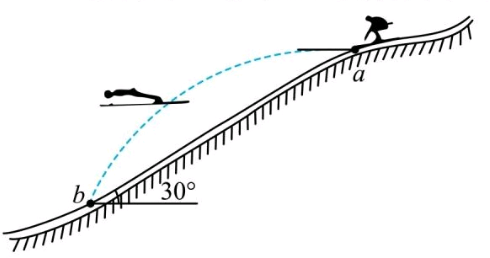

17．北京冬奥会将于2022年2月4日在北京开幕，跳台滑雪比赛是北京冬奥会的重要比赛项。某运动员为取得优异成绩，加强赛前训练。在一次赛前训练中，他从跳台$a$处沿水平方向飞出，在斜坡$b$处着陆，如图所示。已知运动员在空中飞行的时间为$1.2s$，斜坡与水平方向的夹角为$30°$，不计空气阻力，$g$取$10m/s^2$。求

(1）运动员在$a$处的初速度大小；

(2）运动员落到$b$处前瞬间的速度大小；

(3）运动员落到$b$处前瞬间的速度方向与水平方向夹角的正切值。

(1)
由题，有竖直方向
$$\Delta h=\frac{1}{2}gt^2=7.2m$$
故有
$$v_a=\frac{\Delta h}{\tan\theta\times t} =6\sqrt{2}m/s$$

(2)
